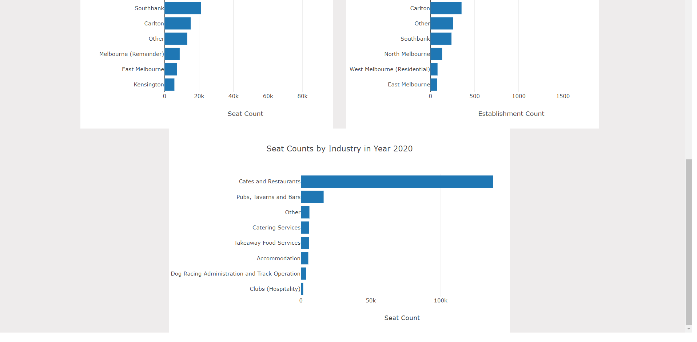

# Cafe and Restaurant Data Dashboard

## Aim

The aim of this project is to create visualisation on the number of establishment and capacity of cafe and restaurant in the City of Melbourne from 2002 to 2020.  

## Data Source

https://data.melbourne.vic.gov.au/

## Method
- API call from data source
- Data is stored in SQLite
- SQLalchemy is used to query data and pandas to clean and organise the data
- Data is converted to JSON for API endpoints and deployed using flask
- D3 is used to call the API endpoints in Javascript and HTML to present the visualisation
- Deploy the visualisation in Heroku

Heroku app is located in link below

https://project-no-3.herokuapp.com/

## Tools
Jupyter Notebook, Pandas, Sqlite, Flask, HTML, Leaflet, Sqlalchemy, Rslider, Heroku

## Group Member
David Salim, Ron Fu, Sam Vuong, Steven Bouios

## Application Screenshots
### Dashboard
 
 

### Analysis
 

### Data Table
 

### Seating Map
 
